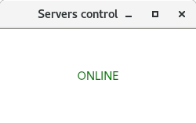
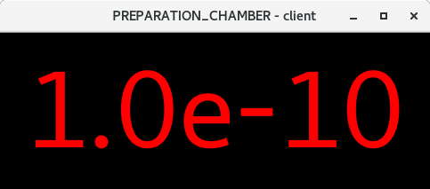
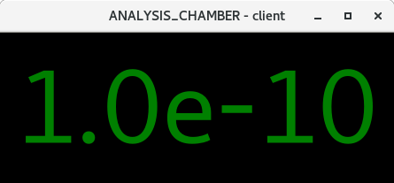
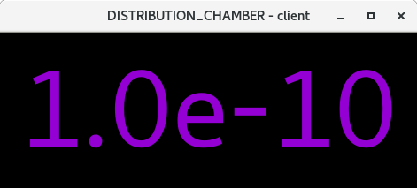

## Network Device Monitor

Welcome to a Network Device Monitor project!

This package was originally created for monitoring serial devices in EP4 ARPES lab in Wuerzburg University, mainly UHV pressure controllers of different type.

The logic is as follows:

1. Configure list_of_servers for your own system by editing dictionary.
2. Provide/write a driver for your serial device (see examples here).
3. list_of_servers provides required info for both main monitoring server as well as clients that get values and show them.
4. Start main server.

5. Start as many clients as you wish from any PC in your network.

Feel free to use it in your own projects. 