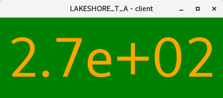
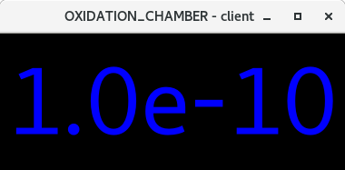
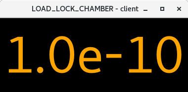

## Network Device Monitor

Welcome to a Network Device Monitor project!

For the latest documentation, see **[ReadTheDocs](https://network-device-monitor.readthedocs.io/en/latest/)**.

This package was originally created for monitoring serial devices in EP4 ARPES lab in Wuerzburg University, mainly UHV pressure controllers of different type.

The logic is as follows:

1. Configure list_of_servers for your own system by editing dictionary.
2. Provide/write a driver for your serial device (see examples here).
3. list_of_servers provides required info for both main monitoring server as well as clients that get values and show them.
4. Start the Main Server - this will only start those servers which IP corresponds to the current IP - feel free to change it.

5. Start as many clients as you wish from any PC in your network.

